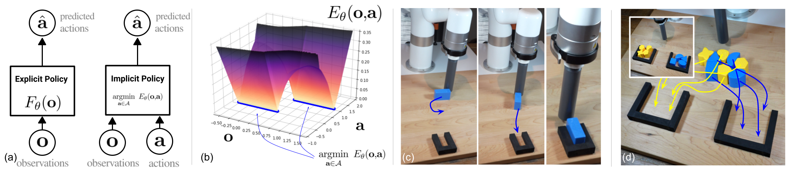
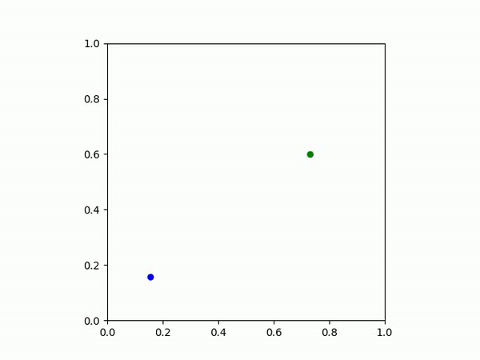

# Implicit Behavioral Cloning

This codebase contains the official implementation of the *Implicit Behavioral Cloning (IBC)* algorithm from our paper:


**Implicit Behavioral Cloning [(website link)](https://implicitbc.github.io/)  [(arXiv link)](https://arxiv.org/abs/2109.00137)** </br>
*Pete Florence, Corey Lynch, Andy Zeng, Oscar Ramirez, Ayzaan Wahid, Laura Downs, Adrian Wong, Johnny Lee, Igor Mordatch, Jonathan Tompson* </br>
Conference on Robot Learning (CoRL) 2021

  |  
:-------------------------:|:-------------------------:|



## Abstract

We find that across a wide range of robot policy learning scenarios, treating supervised policy learning with an implicit model generally performs better, on average, than commonly used explicit models. We present extensive experiments on this finding, and we provide both intuitive insight and theoretical arguments distinguishing the properties of implicit models compared to their explicit counterparts, particularly with respect to approximating complex, potentially discontinuous and multi-valued (set-valued) functions. On robotic policy learning tasks we show that implicit behavioral cloning policies with energy-based models (EBM) often outperform common explicit (Mean Square Error, or Mixture Density) behavioral cloning policies, including on tasks with high-dimensional action spaces and visual image inputs. We find these policies provide competitive results or outperform state-of-the-art offline reinforcement learning methods on the challenging human-expert tasks from the D4RL benchmark suite, despite using no reward information. In the real world, robots with implicit policies can learn complex and remarkably subtle behaviors on contact-rich tasks from human demonstrations, including tasks with high combinatorial complexity and tasks requiring 1mm precision.

## Prerequisites

The code for this project uses python 3.7+ and the following pip packages:

```bash
python3 -m pip install --upgrade pip
pip install \
  absl-py==0.12.0 \
  gin-config==0.4.0 \
  matplotlib==3.4.3 \
  mediapy==1.0.3 \
  opencv-python==4.5.3.56 \
  pybullet==3.1.6 \
  scipy==1.7.1 \
  tensorflow==2.6.0 \
  tensorflow-probability==0.13.0 \
  tf-agents-nightly==0.10.0.dev20210930 \
  tqdm==4.62.2
```


For (optional) Mujoco / D4RL support, you will also need additional pre-reqs. You'll need some non-Python pre-reqs:

1. Ensure a local Mujoco installed (see
[here](https://github.com/openai/mujoco-py#install-mujoco) for installation details), you'll need `~/.mujoco/mujoco200` and `~/.mujoco/mjkey.txt`
2. `sudo apt-get install libosmesa6-dev`
3. Install patchelf, for example with [these few commands.](https://github.com/openai/mujoco-py/issues/147#issuecomment-361417560)

And then Python packages:

```bash
pip install mujoco_py==2.0.2.5
```

```
git clone https://github.com/rail-berkeley/d4rl.git
cd d4rl
# edit the setup.py file as here: https://github.com/rail-berkeley/d4rl/pull/126
pip install -e .
```
Note in our case we needed some symlinks as follows to make various packages happy: `cd ~/.mujoco && sudo ln -s mujoco200_linux mujoco200)`.


## Quickstart

**Step 1**: Install listed Python packages above in  [Prerequisites](#Prequisites).

**Step 2**: Run unit tests (should take less than a minute), and do this from the directory *just above the top-level `ibc` directory*:

```bash
./ibc/run_tests.sh
```

**Step 3**: Check that Tensorflow has GPU access:

```bash
python3 -c "import tensorflow as tf; print(tf.test.is_gpu_available())"
```

If the above prints `False`, see the following requirements, notably CUDA 11.2 and cuDNN 8.1.0: https://www.tensorflow.org/install/gpu#software_requirements.

**Step 4**: Let's do an example Block Pushing task, so first let's **download oracle data** (or see [Tasks](#tasks) for how to generate it):

```bash
cd ibc/data
wget https://storage.googleapis.com/brain-reach-public/ibc_data/block_push_states_location.zip
unzip block_push_states_location.zip && rm block_push_states_location.zip
cd ../..
```

**Step 5**: Set PYTHONPATH to include the directory *just above top-level `ibc`*, so if you've been following the commands above it is:

```bash
export PYTHONPATH=$PYTHONPATH:${PWD}
```

**Step 6**: On that example Block Pushing task, we'll next do a **training + evaluation** with Implicit BC:

```bash
python3 ibc/ibc/train_eval.py -- \
  --alsologtostderr \
  --gin_file=ibc/ibc/configs/pushing_states/mlp_ebm.gin \
  --task=PUSH \
  --tag=ibc_dfo \
  --add_time=True \
  --gin_bindings="train_eval.dataset_path='ibc/data/block_push_states_location/oracle_push*.tfrecord'" \
  --video
```

*Some notes*:

- Alternatively to copy+pasting the block of command-line args above, you can just: `./ibc/ibc/configs/pushing_states/run_mlp_ebm.sh`.
- On an example single-GPU machine (GTX 2080 Ti), the above trains at about 18 steps/sec, and should get to high success rates in 5,000 or 10,000 steps (roughly 5-10 minutes of training).
- The `mlp_ebm.gin` is just one config, with is meant to be reasonably fast to train, with only 20 evals at each interval, and is not suitable for all tasks.  See [Tasks](#tasks) for more configs.
- Due to the `--video` flag above, you can watch a video of the learned policy in action at: `/tmp/ibc_logs/mlp_ebm/ibc_dfo/`... navigate to the `videos/ttl=7d` subfolder, and by default there should be one example `.mp4` video saved every time you do an evaluation interval.

**(Optional) Step 7**: For the pybullet-based tasks, we also have real-time interactive visualization set up through a visualization server, so in one terminal:

```bash
cd <path_to>/ibc/..
export PYTHONPATH=$PYTHONPATH:${PWD}
python3 -m pybullet_utils.runServer
```

And in a different terminal run the oracle a few times with the `--shared_memory` flag:

```bash
cd <path_to>/ibc/..
export PYTHONPATH=$PYTHONPATH:${PWD}
python3 ibc/data/policy_eval.py -- \
  --alsologtostderr \
  --shared_memory \
  --num_episodes=3 \
  --policy=oracle_push \
  --task=PUSH
```

**You're done with Quickstart!**  See other sections below for [Codebase Overview](#codebase-overview), [Workflow](#workflow), and more [Tasks](#tasks).

## Codebase Overview

The highest level structure contains:


- `ibc/`
    - `data/` <-- tools to generate datasets, and feed data for training
    - `environments/` <-- a collection of environments
    - `networks/` <-- TensorFlow models for state inputs and/or vision inputs
    - ...

The above directories are algorithm-agnostic, and the implementation of specific algorithms
are mostly in:

- `ibc/ibc/`
    - `agents/` <-- holds the majority of the BC algorithm details, including:
        - `ibc_agent.py` <-- class for IBC training
        - `ibc_policy.py` <-- class for IBC inference
        - `mcmc.py` <-- implements optimizers used for IBC training/inference
        - similar files for MSE and MDN policies.
    - `losses/` <-- loss functions
        - `ebm_loss.py` <-- several different EBM-style loss functions.
        - `gradient_loss.py` <-- gradient penalty for Langevin
    - `configs/` <-- configurations for different trainings (including hyperparams)
    - ... other various utils for making training and evaluation happen.

A couple more notes for you the reader:

1. The codebase was optimized for large-scale experimentation and trying out many different ideas.  With hindsight it could be much simpler to implement a simplified version of only the core essentials.
2. The codebase heavily uses TF Agents, so we don't have to re-invent various wheels, and it is recommended you take a look at the Guide to get a sense: https://www.tensorflow.org/agents/overview


## Workflow

For each task we will **(1) acquire data** either by:

  - (a) Generating training data from scratch with scripted oracles (via `policy_eval.py`), **OR**
  - (b) Downloading training data from the web.

And then **(2) run a train+eval** by:

  - Running both training and evaluation in one script (via `train_eval.py`)

Note that each train+eval will spend a minute or two
computing normalization statistics, then start training with example printouts:

```bash
I1013 22:26:42.807687 139814213846848 triggers.py:223] Step: 100, 11.514 steps/sec
I1013 22:26:48.352215 139814213846848 triggers.py:223] Step: 200, 18.036 steps/sec
```

And at certain intervals (set in the configs), run evaluations:

```bash
I1013 22:19:30.002617 140341789730624 train_eval.py:343] Evaluating policy.
...
I1013 22:21:11.054836 140341789730624 actor.py:196]
		 AverageReturn = 21.162763595581055
		 AverageEpisodeLength = 48.79999923706055
		 AverageFinalGoalDistance = 0.016136236488819122
		 AverageSuccessMetric = 1.0

```

There is **Tensorboard** support which can be obtained (for default configs) by running the following (and then going to `localhost:6006` in a browser.  (Might be slightly different for you to set up -- let us know if there are any issues.)

```bash
tensorboard --logdir /tmp/ibc_logs
```

And several chunks of useful information can be found in the train+eval log dirs for each experiment, which will end up for example at `/tmp/ibc_logs/mlp_ebm` after running the first suggested training.  For example `operative-gin-config.txt` will save out all the hyperparameters used for that training.


## Tasks

### Task: Block Pushing (from state observations)

#### Get Data

We can either generate data from scratch (~2 minutes for 2,000 episodes: 200 each across 10 replicas):

```bash
./ibc/ibc/configs/pushing_states/collect_data.sh
```

Or we can download data from the web:<a name="pushing-states-data"></a>

```bash
cd ibc/data/
wget https://storage.googleapis.com/brain-reach-public/ibc_data/block_push_states_location.zip
unzip 'block_push_states_location.zip' && rm block_push_states_location.zip
cd ../..
```

#### Train and Evaluate

Here's reasonably fast-to-train config for *IBC with DFO*:

<!--  partial verified: 100% in 10k steps, 18 steps/sec -->
```bash
./ibc/ibc/configs/pushing_states/run_mlp_ebm.sh
```

Or here's a config for *IBC with Langevin*:

<!--  partial verified: 95% in 5k steps, 6.5 steps/sec -->
```bash
./ibc/ibc/configs/pushing_states/run_mlp_ebm_langevin.sh
```

Or here's a comparable, reasonably fast-to-train config for *MSE*:

<!--  partial verified: 85% in 10k steps, 18 steps/sec -->
```bash
./ibc/ibc/configs/pushing_states/run_mlp_mse.sh
```

Or to run the **best configs** respectfully **for IBC, MSE, and MDN** (some of these might be slower to train than the above): <a name="pushing-states-train"></a>

<!--  partial verified: 100% at 15k steps, 18 steps/sec -->
<!--  partial verified: 87% at 15k steps, 18 steps/sec -->
<!--  partial verified: 75% at 5k steps, 18 steps/sec -->
```bash
./ibc/ibc/configs/pushing_states/run_mlp_ebm_best.sh
./ibc/ibc/configs/pushing_states/run_mlp_mse_best.sh
./ibc/ibc/configs/pushing_states/run_mlp_mdn_best.sh
```

### Task: Block Pushing (from image observations)

#### Get Data

Download data from the web: <a name="pushing-pixels-data"></a>

```bash
cd ibc/data/
wget https://storage.googleapis.com/brain-reach-public/ibc_data/block_push_visual_location.zip
unzip 'block_push_visual_location.zip' && rm block_push_visual_location.zip
cd ../..
```

#### Train and Evaluate

Here is an *IBC with Langevin* configuration which should actually converge faster than the IBC-with-DFO that we reported in the paper:

<!--  partial verified: 100% at 10k steps, 6.5 steps/sec, at 90x120 w/ 128 batch-->
<!--  partial verified: 100% at 5k steps, 4.1 steps/sec, at 180x240 w/ 128 batch-->
```bash
./ibc/ibc/configs/pushing_pixels/run_pixel_ebm_langevin.sh
```

And here are the **best configs** respectfully for **IBC** (with DFO), **MSE**, and **MDN**: <a name="pushing-pixels-train"></a>

<!-- partial verified: 94% at 10k steps, 8.0 steps/sec, 180x240 w/ 128 batch-->
<!-- partial verified: 68% at 10k steps, 9.0 steps/sec, 180x240 w/ 128 batch -->
<!-- partial verified: 94% at 15k steps, 9.0 steps/sec, 90x120 w/ 128 batch -->
```bash
./ibc/ibc/configs/pushing_pixels/run_pixel_ebm_best.sh
./ibc/ibc/configs/pushing_pixels/run_pixel_mse_best.sh
./ibc/ibc/configs/pushing_pixels/run_pixel_mdn_best.sh
```

### Task: Particle

IBC  | MSE
:-------------------------:|:-------------------------:
  |   |

#### Get Data

We can either generate data from scratch, for example for 2D (takes 15 seconds):

```bash
./ibc/ibc/configs/particle/collect_data.sh
```

Or to do N-D, change `ParticleEnv.n_dim` in `third_party/py/ibc/environments/particle/particle.py`, and also change the saving data path in `collect_data.sh`.

TODO(peteflorence): this should be settable in open-source once this commit lands in a tf-agents release: https://github.com/tensorflow/agents/commit/1ef31b9a8a037924d6c33307650958130e1bb140

Or just download all the data for all different dimensions: <a name="particle-data"></a>

```bash
cd ibc/data/
wget https://storage.googleapis.com/brain-reach-public/ibc_data/particle.zip
unzip particle.zip && rm particle.zip
cd ../..
```

#### Train and Evaluate

Let's start with some small networks, on just the 2D version since it's easiest to visualize, and compare MSE and IBC.  Here's a small-network (256x2) IBC-with-Langevin config, and the 2 is the argument for the environment dimensionality.

<!--  partial verified: 96% success, 10k steps, 50 episodes evaluated, 13.3 steps/sec  -->
```bash
./ibc/ibc/configs/particle/run_mlp_ebm_langevin.sh 2
```

And here's an idenitcally sized network (256x2) but with MSE config:

<!--  partial verified: 5% success, 10k steps, 20 episodes evaluated, 21.7 steps/sec  -->
```bash
./ibc/ibc/configs/particle/run_mlp_mse.sh 2
```

For the above configurations, we suggest comparing the rollout videos, which you can find at `/tmp/ibc_logs/...corresponding_directory../videos/`. At the top of this section is shown a comparison at 10,000 training steps for the two different above configs.


And here are the **best configs** respectfully for **IBC** (with langevin) and **MSE**, in this case run on the 16-dimensional environment: <a name="particle-train"></a>

```
./ibc/ibc/configs/particle/run_mlp_ebm_langevin_best.sh 16
./ibc/ibc/configs/particle/run_mlp_mse_best.sh 16
```


### Task: D4RL Adroit and Kitchen

#### Get Data

The D4RL human demonstration training data used for the paper submission can be downloaded using the commands below.  This data has been processed into a `.tfrecord` format from the original D4RL data format: <a name="d4rl-data"></a>

```bash
cd ibc/data && mkdir -p d4rl_trajectories && cd d4rl_trajectories
wget https://storage.googleapis.com/brain-reach-public/ibc_data/door-human-v0.zip \
     https://storage.googleapis.com/brain-reach-public/ibc_data/hammer-human-v0.zip \
     https://storage.googleapis.com/brain-reach-public/ibc_data/kitchen-complete-v0.zip \
     https://storage.googleapis.com/brain-reach-public/ibc_data/kitchen-mixed-v0.zip \
     https://storage.googleapis.com/brain-reach-public/ibc_data/kitchen-partial-v0.zip \
     https://storage.googleapis.com/brain-reach-public/ibc_data/pen-human-v0.zip \
     https://storage.googleapis.com/brain-reach-public/ibc_data/relocate-human-v0.zip
unzip '*.zip' && rm *.zip
cd ../../..
```

### Run Train Eval:


Here are the **best configs** respectfully for **IBC** (with Langevin), and **MSE**: <a name="d4rl-train"></a>
On a 2080 Ti GPU test, this IBC config trains at only 1.7 steps/sec, but it is about 10x faster on TPUv3.


<!--  partial verified: 2704.5 avg return on pen, 10k steps, 100 episodes evaluated, 1.7 steps/sec  -->
<!--  partial verified: 1660.4 avg return on pen, 10k steps, 100 episodes evaluated, 25.5 steps/sec  -->

```bash
./ibc/ibc/configs/d4rl/run_mlp_ebm_langevin_best.sh pen-human-v0
./ibc/ibc/configs/d4rl/run_mlp_mse_best.sh pen-human-v0
```

The above commands will run on the `pen-human-v0` environment, but you can swap this arg for whichever of the provided Adroit/Kitchen environments.

Here also is an MDN config you can try.  The network size is tiny but if you increase it heavily then it seems to get NaNs during training. In general MDNs can be finicky.  A solution should be possible though.

```
./ibc/ibc/configs/d4rl/run_mlp_mdn.sh pen-human-v0
```

## Summary for Reproducing Results

For the tasks that we've been able to open-source, results from the paper should be reproducible by using the linked data and command-line args below.

| Task  | Figure/Table in paper | Data | Train + Eval commands |
| --- | --- | --- | --- | --- |
| Coordinate regression  | Figure 4  | See colab | See colab | See colab |
| D4RL Adroit + Kitchen  | Table 2 | [Link](#d4rl-data) | [Link](#d4rl-train) |
| N-D particle  | Figure 6 | [Link](#particle-data) | [Link](#particle-train) |
| Simulated pushing, single target, states  | Table 3 | [Link](#pushing-states-data) | [Link](#pushing-states-train) |
| Simulated pushing, single target, pixels | Table 3 | [Link](#pushing-pixels-data) | [Link](#pushing-pixels-train) |


## Citation

If you found our paper/code useful in your research, please consider citing:

```
@article{
  author = {Pete Florence, Corey Lynch, Andy Zeng, Oscar Ramirez, Ayzaan Wahid, Laura Downs, Adrian Wong, Johnny Lee, Igor Mordatch, Jonathan Tompson},
  title = {Implicit Behavioral Cloning},
  journal = {Conference on Robotic Learning (CoRL)},
  month = {November},
  year = {2021},
}
```
